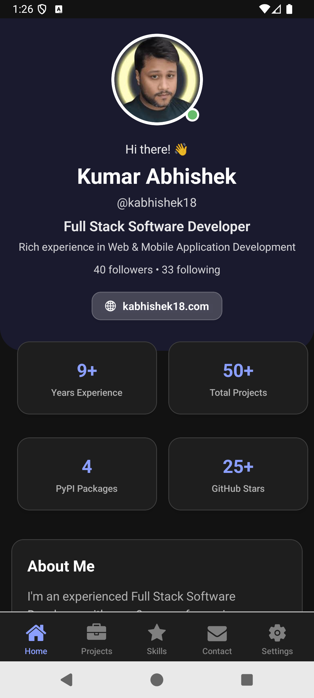
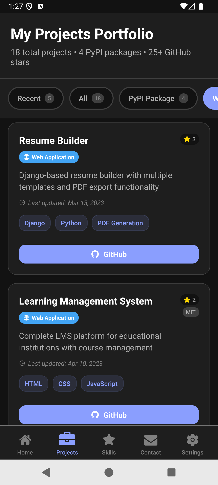
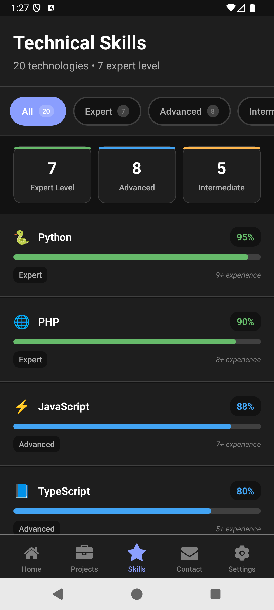
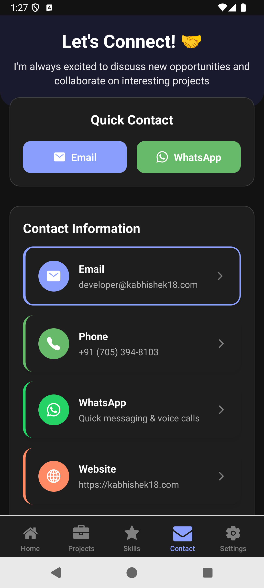
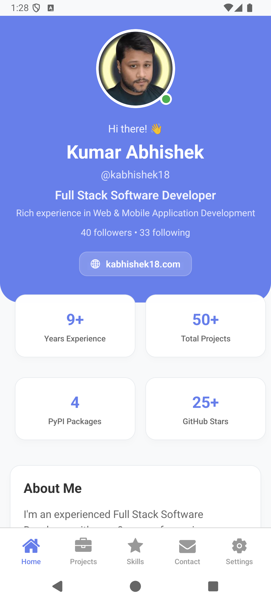
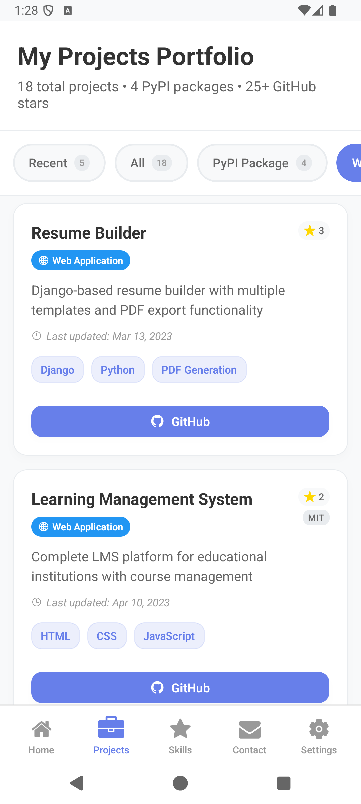
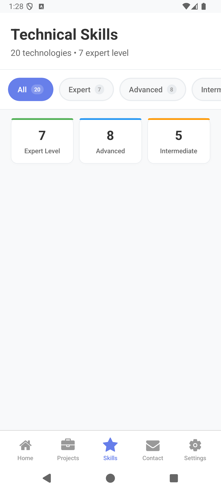
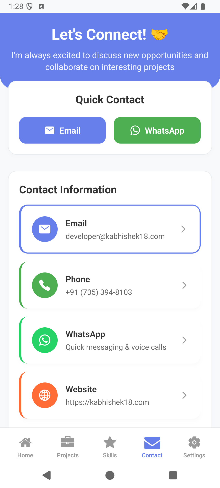
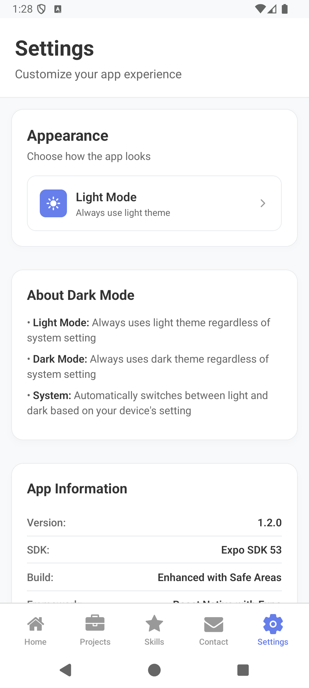
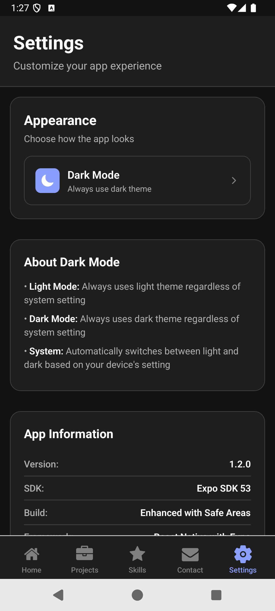

# 📱 Portfolio App - Kumar Abhishek

A modern, feature-rich portfolio mobile application built with React Native and Expo, showcasing professional experience, projects, skills, and contact information with a beautiful dark/light theme system.

[](https://expo.dev/)
[](https://reactnative.dev/)
[](https://www.typescriptlang.org/)
[](LICENSE)

## 📱 Screenshots

<div align="center">
  
  
  
  
</div>
<div align="center">
  
  
  
  
</div>
<div align="center">
  
  
</div>

## ✨ Latest Release - v1.2.0

### 🌟 Major Features Added
- **🌓 Advanced Dark/Light Theme System** - Automatic system sync with manual override
- **📱 Safe Area Implementation** - Perfect layout on all devices with notches/dynamic islands
- **🎨 Enhanced UI/UX** - Glassmorphism effects, micro-animations, and modern design
- **🧱 Modular Architecture** - Reusable components with TypeScript support
- **⚡ Performance Optimizations** - Smooth animations and optimized rendering

### 🔧 Technical Improvements
- **SDK Update**: Upgraded to Expo SDK 53 for latest features and security
- **Safe Areas**: Implemented react-native-safe-area-context for proper spacing
- **TypeScript**: Full type safety across all components
- **Theme Context**: Advanced theming system with context providers
- **Bug Fixes**: Resolved navigation issues and improved stability

### 🎯 Bug Patches & Fixes
- Fixed tab bar spacing on devices with home indicators
- Resolved status bar color issues in different themes
- Improved component rendering performance
- Fixed gesture handler conflicts
- Corrected theme toggle functionality

## 🚀 Features

### 🎨 **Advanced Theme System**
- **Light Mode**: Clean, professional light interface
- **Dark Mode**: Modern dark theme for low-light usage
- **System Mode**: Automatically follows device theme
- **Smooth Transitions**: Seamless theme switching with animations

### 📊 **Portfolio Sections**
- **Home**: Professional profile with stats and achievements
- **Projects**: Filterable project showcase with GitHub/PyPI links
- **Skills**: Interactive skill levels with progress indicators
- **Contact**: Multiple contact methods with direct integration
- **Settings**: Theme customization and app information

### 🛠️ **Technical Features**
- **Safe Area Support**: Works perfectly on all device types
- **Gesture Navigation**: Smooth navigation with gesture support
- **Animated Components**: Micro-interactions and smooth transitions
- **Modular Components**: Reusable UI library with TypeScript
- **Cross-Platform**: iOS, Android, and Web support

## 🏗️ Architecture

```
PortfolioApp/
├── app/
│   ├── _layout.tsx                 # Root layout with providers
│   ├── index.tsx                   # App entry point
│   ├── home/
│   │   ├── _layout.tsx            # Tab navigation layout
│   │   ├── index.tsx              # Home screen
│   │   ├── projects.tsx           # Projects showcase
│   │   ├── skills.tsx             # Skills overview
│   │   ├── contact.tsx            # Contact information
│   │   └── settings.tsx           # App settings
│   └── components/
│       └── ui/                    # Reusable UI components
│           ├── Card.tsx
│           ├── Button.tsx
│           ├── Badge.tsx
│           ├── ProjectCard.tsx
│           ├── SkillCard.tsx
│           ├── ContactButton.tsx
│           ├── ThemeToggle.tsx
│           ├── FilterButton.tsx
│           └── types.ts           # TypeScript definitions
├── contexts/
│   └── ThemeContext.tsx           # Theme management
├── constants/
│   └── portfolioData.ts           # App data and content
└── assets/
    ├── images/                    # App icons and images
    └── screenshots/               # App screenshots
```

## 🛠️ Installation & Setup

### Prerequisites
- Node.js 18+
- Expo CLI
- iOS Simulator (Mac) or Android Studio
- Expo Go app on your device

### Quick Start

```bash
# Clone the repository
git clone https://github.com/kabhishek18/PortfolioApp.git
cd PortfolioApp

# Install dependencies
npm install

# Start development server
npx expo start

# Run on specific platform
npx expo start --ios      # iOS Simulator
npx expo start --android  # Android Emulator
npx expo start --web      # Web Browser
```

### Dependencies

```json
{
  "expo": "~53.0.10",
  "react": "19.0.0",
  "react-native": "0.79.3",
  "react-native-safe-area-context": "5.4.0",
  "react-native-gesture-handler": "~2.24.0",
  "expo-router": "~5.0.7",
  "expo-blur": "^14.1.5"
}
```

## 🎯 Usage

### Running the App

1. **Development Mode**:
   ```bash
   npx expo start --clear
   ```

2. **Device Testing**:
    - Install Expo Go on your device
    - Scan QR code from terminal

3. **Production Build**:
   ```bash
   # Install EAS CLI
   npm install -g @expo/cli
   
   # Build for Android
   npx expo build:android
   
   # Build for iOS
   npx expo build:ios
   ```

### Customization

1. **Update Profile Data**:
   ```typescript
   // constants/portfolioData.ts
   export const portfolioData = {
     profile: {
       name: "Your Name",
       title: "Your Title",
       // ... update other fields
     }
   };
   ```

2. **Add/Modify Projects**:
   ```typescript
   // Add to recentProjects or allProjects array
   {
     id: 999,
     title: "New Project",
     description: "Project description",
     technologies: ["React", "TypeScript"],
     githubUrl: "https://github.com/username/project"
   }
   ```

3. **Customize Theme**:
   ```typescript
   // contexts/ThemeContext.tsx
   export const lightColors = {
     primary: '#your-color',
     // ... other colors
   };
   ```

## 🎨 Theme System

The app features an advanced theming system:

### Theme Options
- **Light Mode**: Professional light interface
- **Dark Mode**: Modern dark theme
- **System**: Follows device setting

### Implementation
```typescript
const { colors, theme, toggleTheme } = useTheme();

// Theme-aware components automatically adapt
<View style={{ backgroundColor: colors.surface }}>
  <Text style={{ color: colors.text }}>Content</Text>
</View>
```

## 📱 Screens Overview

### 🏠 Home Screen
- Professional profile with photo
- Key statistics and achievements
- Current work and specializations
- Domain expertise overview
- Social links and quick actions

### 💼 Projects Screen
- Filterable project showcase
- Project categories (PyPI, Web App, Tools, etc.)
- GitHub stars and license information
- Direct links to repositories and packages

### 🛠️ Skills Screen
- Interactive skill level indicators
- Categorized by proficiency (Expert, Advanced, Intermediate)
- Progress bars with animations
- Years of experience for each skill

### 📞 Contact Screen
- Multiple contact methods
- Direct integration with email, phone, WhatsApp
- Social and professional links
- Availability status and response time

### ⚙️ Settings Screen
- Theme customization options
- App information and version details
- Feature overview

## 🔧 Development

### Adding New Components

1. Create component in `app/components/ui/`:
   ```typescript
   // app/components/ui/NewComponent.tsx
   interface NewComponentProps {
     title: string;
     onPress: () => void;
   }
   
   const NewComponent: React.FC<NewComponentProps> = ({ title, onPress }) => {
     const { colors } = useTheme();
     // Component implementation
   };
   ```

2. Export from index:
   ```typescript
   // app/components/ui/index.ts
   export { default as NewComponent } from './NewComponent';
   ```

3. Add TypeScript types:
   ```typescript
   // app/components/ui/types.ts
   export interface NewComponentProps extends BaseComponentProps {
     title: string;
     onPress: () => void;
   }
   ```

### Safe Area Implementation

All screens use safe area context for proper spacing:

```typescript
import { SafeAreaView, useSafeAreaInsets } from 'react-native-safe-area-context';

const Screen = () => {
  const insets = useSafeAreaInsets();
  
  return (
    <SafeAreaView style={styles.container} edges={['top']}>
      <ScrollView contentContainerStyle={{ 
        paddingBottom: insets.bottom + 85 
      }}>
        {/* Content */}
      </ScrollView>
    </SafeAreaView>
  );
};
```

## 🚀 Deployment

### Expo Go (Recommended for Development)
```bash
npx expo start
# Scan QR code with Expo Go app
```

### EAS Build (Production)
```bash
# Configure EAS
npx expo install @expo/cli
eas build:configure

# Build for Android
eas build --platform android

# Build for iOS
eas build --platform ios
```

### Web Deployment
```bash
npx expo export --platform web
# Deploy the 'dist' folder to your hosting service
```

## 🤝 Contributing

1. Fork the repository
2. Create a feature branch: `git checkout -b feature/amazing-feature`
3. Commit changes: `git commit -m 'Add amazing feature'`
4. Push to branch: `git push origin feature/amazing-feature`
5. Open a Pull Request

## 📄 License

This project is licensed under the MIT License - see the [LICENSE](LICENSE) file for details.

## 👨‍💻 Author

**Kumar Abhishek**
- Website: [kabhishek18.com](https://kabhishek18.com)
- GitHub: [@kabhishek18](https://github.com/kabhishek18)
- LinkedIn: [kabhishek18](https://linkedin.com/in/kabhishek18)
- Email: developer@kabhishek18.com

## 🙏 Acknowledgments

- [Expo](https://expo.dev/) for the amazing development platform
- [React Native](https://reactnative.dev/) for cross-platform mobile development
- [TypeScript](https://www.typescriptlang.org/) for type safety
- [Ionicons](https://ionic.io/ionicons) for beautiful icons

## 📊 Stats

- **Lines of Code**: 5,000+
- **Components**: 15+ reusable UI components
- **Screens**: 5 main screens with navigation
- **Themes**: 2 complete themes (Light/Dark)
- **Platforms**: iOS, Android, Web

---

<div align="center">
  <p>Made with ❤️ by <a href="https://github.com/kabhishek18">Kumar Abhishek</a></p>
  <p>⭐ Star this repo if you found it helpful!</p>
</div>